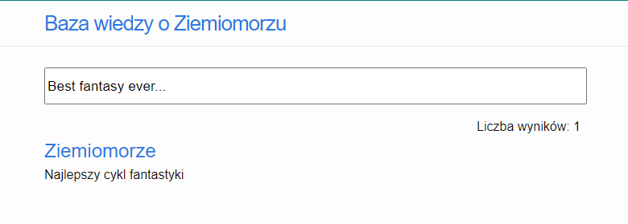
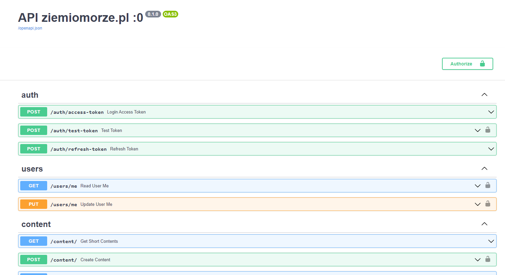

## Ziemiomorze

- Prod site https://new.ziemiomorze.pl - React App
- Prod API https://api.ziemiomorze.pl - FastAPI App

<br>




## Local developement

```bash
git clone https://github.com/rafsaf/new_earthsea.git
cd new_earthsea

# in 1st terminal window
cd backend
poetry install
# and activate environment

cp .env.example .env
# change something if u want

docker-compose up -d
bash init.sh
uvicorn app.main:app --reload

# in 2nd terminal window
cd frontend
npm install
npm start
```
